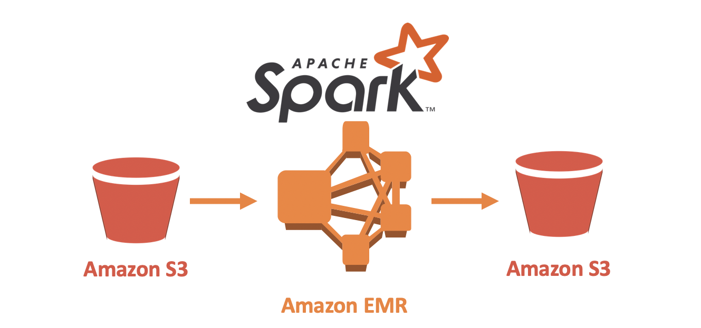

# Project 4: Data Lake in AWS using S3 and Amazon EMR with Apache Spark



This project is the fourth project of the Data Engineering Nanodegree Program of Udacity.

In this project, I will apply what I have learned on Spark and data lakes to build an ETL pipeline for a data lake hosted on S3. To complete this project, I will load data from S3, process the data into analytics tables using Spark, and load them back into S3. I will deploy this Spark process on a cluster using Amazon EMR.

## Introduction

A music streaming startup, Sparkify, has grown their user base and song database even more and want to move their data warehouse to a data lake. Their data resides in S3, in a directory of JSON logs on user activity on the app, as well as a directory with JSON metadata on the songs in their app.

As their data engineer, you are tasked with building an ETL pipeline that extracts their data from S3, processes them using Spark, and loads the data back into S3 as a set of dimensional tables. This will allow their analytics team to continue finding insights in what songs their users are listening to.

You'll be able to test your database and ETL pipeline by running queries given to you by the analytics team from Sparkify and compare your results with their expected results.

## Data

In this ETL pipeline there are two types of data:

- **Song Dataset**: The first dataset is a subset of real data from the Million Song Dataset. Each file is in JSON format and contains metadata about a song and the artist of that song. The files are partitioned by the first three letters of each song's track ID. For example, here are filepaths to two files in this dataset.

- **Log Dataset**: The second dataset consists of log files in JSON format generated by this [event simulator](https://github.com/Interana/eventsim) based on the songs in the dataset above. These simulate activity logs from a music streaming app based on specified configurations.

## Database schema

The database schema includes the following tables:

**Fact Table**
- **songplays**: Records in log data associated with song plays i.e. records with page NextSong
    - *songplay_id, start_time, user_id, level, song_id, artist_id, session_id, location, user_agent*

**Dimension Tables**
- **users**: Users in the app
    - *user_id, first_name, last_name, gender, level*
- **songs**: Songs in music database
    - *song_id, title, artist_id, year, duration*
- **artists**: Artists in music database
    - *artist_id, name, location, latitude, longitude*
- **time**: Timestamps of records in songplays broken down into specific units
    - *start_time, hour, day, week, month, year, weekday*

The visual design of the **star schema** of the database is the following:


This visual design was created in the website [dbdiagram.io](https://dbdiagram.io).

## Project structure

In addition to the data files, the project workspace includes six files:

1. [dl_template.cfg](dl_template.cfg) file in where we store the AWS credentials.
2. [etl.py](etl.py) reads data from S3, processess that data using Spark in a Amazon EMR cluster, and writes them back to S3.
3. [README.md](README.md) description of the project.

## Installation

To run the files in this project first you need to install the following libraries.

Use the package manager [pip](https://pip.pypa.io/en/stable/) to install the following packages.

```bash
pip install pandas
pip install pyspark
pip install configparser
```

Another option is to install Anaconda and use `conda` to install this packages.

## Usage

The main file is [etl.py](etl.py). This file will read the data from S3, create an Apache Spark session, process the data and finally put back the data in the data lake in S3.

To run the file [etl.py](etl.py) there are two options, running locally or in AWS using an Amazon EMR cluster. To configure this you have to change the following values in the [dl.cfg](dl.cfg) file.

```python
# Run locally
[MODE]
INPUT_DATA = 'data/'
OUTPUT_DATA = 'data_result/'

# Run in AWS
[MODE]
INPUT_DATA = 's3a://udacity-dend/'
OUTPUT_DATA = 's3a://<YOUR_BUCKET_NAME>/'
```

Also, you need to change in the file [etl.py](etl.py) inside the function `process_log_data(spark)` the filepath of the log data files.

```python
# Filepath to log data files running locally
log_data = INPUT_DATA + 'log_data/*.json'

# Filepath to log data files running in AWS
log_data = INPUT_DATA + 'log_data/*/*/*.json'
```

Running locally is recommended to do tests using the small trial data inside the folder [data](data/). The result of this folder will be the same as it is in the folder [data_result](data_result/).

To run the script in a Notebook inside an Amazon EMR cluster you need to do some preconfiguration before. First, you have to create an S3 bucket (or use an existing one) to put the result data. Then, you have to create a new Amazon EMR cluster and a Notebook associated with that cluster. To create an Amzon EMR cluster you have to go to the the AWS console, search for `Amazon EMR` and then click `Create cluster`.


Once you have created the cluster, you can create the Notebook by clicking the option `Notebooks` in the left menu. Here you have the option to create assign an existing cluster or create a new cluster for that Notebook.


Once you have the Amazon EMR cluster up and running, you can go to the Notebook and open the Juptyer Lab. From there you can just run the `etl.py` script. Make sure to change the configuration in the file [dl.cfg](dl.cfg) to be available to run in AWS.

## Contributing

Pull requests are welcome. For major changes, please open an issue first to discuss what you would like to change.

## License

This project is under the license [MIT](https://choosealicense.com/licenses/mit/).